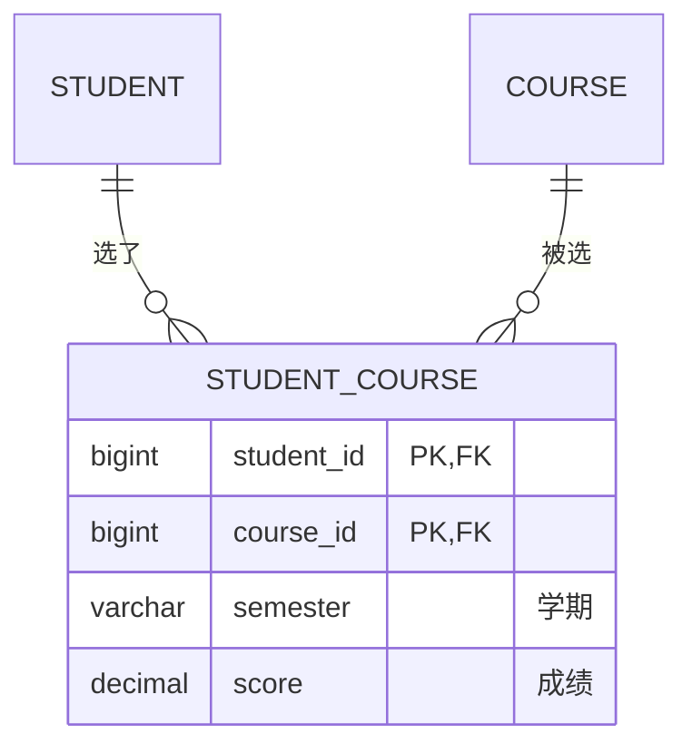
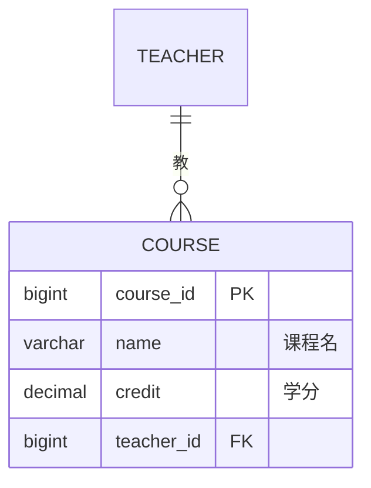
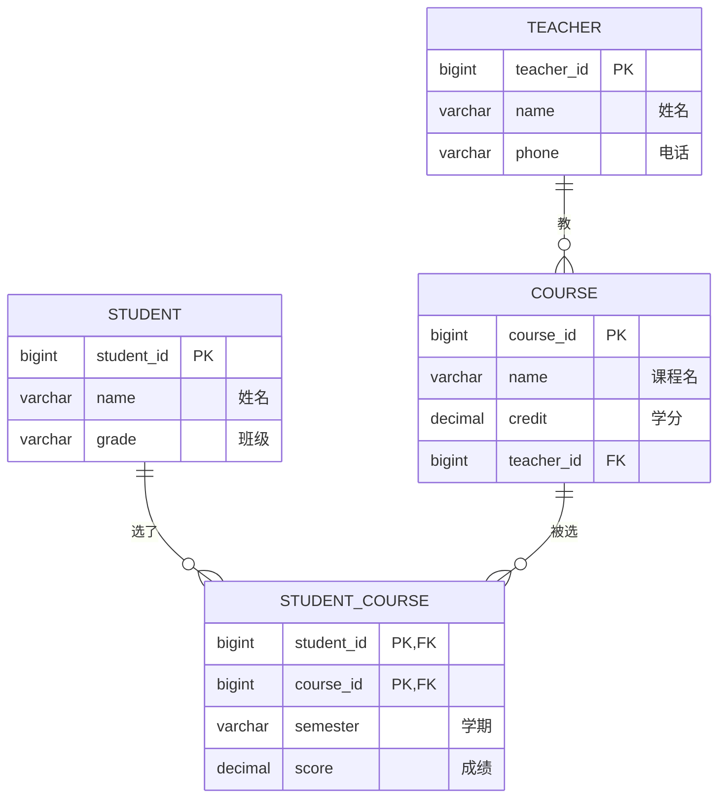

# 数据库设计：从需求到表结构

> 拿到一个需求，怎么设计出表？**不是靠范式**——范式是事后验证质量的尺子（见 [数据库范式](./database-normalization.md)）。真正的设计是从宏观出发：**识别实体 → 看实体间的关系 → 决定表结构**。本文用"学校选课系统"走一遍完整流程。

## 第 1 步：识别实体（找"一等公民"）

把需求里反复出现的**名词**找出来，然后分辨：哪些是**独立实体**（要单独建表），哪些只是**某个实体的属性**（当一个字段）。

> 判断标准：这个名词**能不能脱离别人独立存在**？能独立存在、有自己的属性、需要单独增删改查的，就是实体。

拿学校选课系统的需求看：

```text
需求：记录学生、老师、课程、谁选了哪门课、成绩、学期。
```

| 名词 | 是实体还是属性 | 理由 |
|---|---|---|
| **学生** | 实体 → 建 `student` 表 | 独立存在，有姓名/班级等自己的属性 |
| **老师** | 实体 → 建 `teacher` 表 | 独立存在，有电话/职称等自己的属性 |
| **课程** | 实体 → 建 `course` 表 | 独立存在，有学分等自己的属性 |
| 姓名 / 班级 | 学生的属性 → 当 `student` 的字段 | 依附于学生，离开学生无意义 |
| 电话 / 职称 | 老师的属性 → 当 `teacher` 的字段 | 依附于老师 |
| 学分 | 课程的属性 → 当 `course` 的字段 | 依附于课程 |
| **选课（谁选了哪门课）** | 关系，但带属性 → 建 `student_course` 表 | 既不是学生的属性也不是课程的属性，是"两者之间发生的事"，还带着成绩 |

> 关键判断：**"选课"不是谁的下属，它自己带着"成绩、学期"这些属性**，所以它值得单独一张表。这就是"关系也分两种：有的关系只记录联系，有的关系自己带着信息，带信息的就要单独建表"。

**第 1 步产出**：三个实体表 + 一个关系表。

## 第 2 步：看实体之间的关系（决定表怎么连）

实体找出来后，看它们两两之间的关系是**一对一、一对多，还是多对多**。这决定要不要中间表、外键放哪。

```text
学生 ──？── 课程
老师 ──？── 课程
学生 ──？── 老师
```

### 学生 ↔ 课程：多对多 → 需要中间表

- 一个学生选**多门**课
- 一门课有**多个**学生选

多对多不能直接用外键表达（外键只能表达"从属"，表达不了"双向多"），所以要一张中间表：



> 一个学生对应**多条**中间表记录（`||` → `o{`），一门课也对应**多条**（`||` → `o{`），两条线合起来就是"多对多"。成绩、学期就挂在中间表上。

### 老师 ↔ 课程：一对多 → 外键放"多"的那边

- 一个老师教**多门**课
- 一门课有**一个**老师

一对多用外键表达，外键放在"多"的那边（课程）——每门课存自己的老师是谁：



> 一个老师对应**多门**课（`||` → `o{`），外键 `teacher_id` 放在"多"的那边（课程）——这就是"一对多"用外键表达的样子。

### 学生 ↔ 老师：不直接建表，透过课程间接关联

学生和老师之间没有直接的"归属"或"选课"关系——他们是通过**课程**联系起来的（老师教某门课，学生选某门课）。所以不需要在学生表里放 teacher_id，也不用在老师表里放 student_id，查的时候透过 `course` 和 `student_course` 关联即可。

> 经验法则：
> - **一对多** → 外键放在"多"的一侧
> - **多对多** → 建中间表
> - **透过第三者才能联系** → 不建直接关系，查询时 JOIN

## 第 3 步：得到表结构

实体表 + 关系表 + 外键位置都定了，整套表就出来了：

```text
student( student_id, 姓名, 班级 )                ← 学生实体
teacher( teacher_id, 姓名, 老师电话 )             ← 老师实体
course( course_id, 课程名, credit, teacher_id )  ← 课程实体 + 老师外键（一对多）
student_course( student_id, course_id, 学期, 成绩 ) ← 学生-课程中间表（多对多）
```



> 这就是本项目 `edu_system` 的四张表：`student`、`teacher` 是独立实体；`course` 通过外键 `teacher_id` 挂在老师名下（一对多）；`student_course` 是中间表，把学生和课程接起来（多对多），并带着成绩、学期。**注意：设计过程全程没有提到范式，表却天然合理**——因为"实体该分开建表、多对多该有中间表"本身就是好的宏观设计。

## 第 4 步：用范式验证（质量检查，不是设计动作）

设计完成后，用范式**检查一遍**，确认没有冗余和异常。这一步是"验货"，不是"设计"。

| 表 | 候选键 | 范式检查 | 结论 |
|---|---|---|---|
| `student` | `student_id` | 单主键，无部分/传递依赖 | 满足 3NF |
| `teacher` | `teacher_id` | 单主键，无部分/传递依赖 | 满足 3NF |
| `course` | `course_id` | 单主键；`teacher_id` 是外键，没冗余老师信息 | 满足 3NF |
| `student_course` | `(student_id, course_id)` | 复合主键，但 `成绩`/`学期` 完全依赖它；无传递依赖 | 满足 3NF |

> 四张表都满足 3NF。**如果检查发现问题**（比如某张表有部分依赖、传递依赖），才需要回头拆表——那时才用得上范式的规则。这就是"**宏观设计出结构，范式验证质量**"的完整流程。

---

## 小结

```text
从需求设计数据库，三步走：
1. 识别实体：哪些是独立的一等公民（建表），哪些是属性（当字段）
2. 看关系：一对多 → 外键放多的一侧；多对多 → 建中间表；间接关系 → 不建直接表
3. 得结构：实体表 + 关系表 = 最终表集合

然后：用范式验证一遍（3NF 通常就够），有问题才拆表。
```
