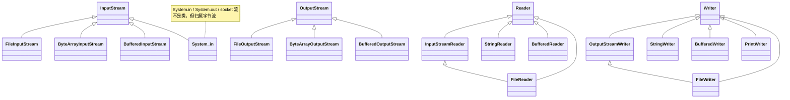
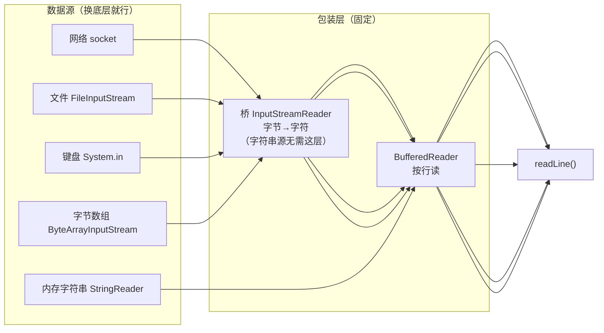

# Java IO 流速查

> 基于本项目的 socket 例子（`Server.java` / `Client.java`）。核心就三条：**一切皆流** → **继承树** → **装饰链 / 换数据源**。需要 IDEA 的 Mermaid 插件才能渲染图。

## 1. 核心概念：一切皆是流（管道）

**流（Stream）就是"数据从一处流向另一处的管道"**——像水管送水一样，送的是数据，只有方向，没有存储。这是整个 IO 体系的底层心智模型，先记住它。

```java
// 读：数据从管道流进程序
InputStream  in = System.in;                  // 键盘 → 程序
InputStream  in = socket.getInputStream();    // 网络 → 程序

// 写：数据从程序流进管道
OutputStream out = System.out;                // 程序 → 屏幕
OutputStream out = socket.getOutputStream();  // 程序 → 网络
```

所以**任何数据读写都抽象成"接一根管道"**：管道的另一端是键盘 / 网络 / 文件 / 字符串……接口一致，换哪头都行（第 4 节就是"换管道"）。

## 2. 继承树（全景）

**字节流** 和 **字符流** 是两棵独立的树。`InputStream` / `OutputStream` 处理原始字节；`Reader` / `Writer` 处理字符。**两棵树抽象根不同、通常不通用**；唯一的特例是 `InputStreamReader` / `OutputStreamWriter`，它们把字节流包进字符侧（见第 3 节）。



> 图中 `System.in`、socket 流不是"类"，画进来只是示意它们归属字节流。

## 3. 装饰器模式：一层套一层，各加一种能力

**包装对象和被包装对象有同一个接口类型**（都是 `Reader` / `Writer` / `InputStream`），所以能无限嵌套，每一层只加一种能力。

```mermaid
flowchart LR
    A["socket.getInputStream()<br/>字节流 · 数据源"] -->|"原始字节"| B["new InputStreamReader(...)<br/>字节→字符（桥）"]
    B -->|"字符"| C["new BufferedReader(...)<br/>按行读 readLine()"]
    C -->|"攒到换行"| D["\"你好，服务端！\" 一整行"]
```

**只有"字节→字符"是跨树操作**（`InputStreamReader`/`OutputStreamWriter` 这层桥），其余都在同一棵树里套。**必须显式指定 `UTF-8`**，否则中文乱码。

**关闭**：try-with-resources 只声明最外层，它会传播关闭内层和 socket。

## 4. 每种数据源都能用流操作

**读** = 数据源 +（字节就加桥）+ 按行读；**写** = 数据源 +（字节就加桥）+ 便捷写者。装饰链只换底层，上层固定：



**网络 / 文件 / 键盘 / 字节数组底层都是字节 → 走 `InputStream`，要加桥；只有内存字符串天然是字符 → `StringReader` 直接是 `Reader`，不用桥。**

### 读（换个底层）

```java
BufferedReader in = new BufferedReader(new InputStreamReader(socket.getInputStream(), StandardCharsets.UTF_8));      // 网络
BufferedReader in = new BufferedReader(new InputStreamReader(new FileInputStream("a.txt"), StandardCharsets.UTF_8));  // 文件
BufferedReader console = new BufferedReader(new InputStreamReader(System.in, StandardCharsets.UTF_8));                 // 键盘
BufferedReader in = new BufferedReader(new InputStreamReader(new ByteArrayInputStream(bytes), StandardCharsets.UTF_8)); // 字节数组
BufferedReader in = new BufferedReader(new StringReader("hello\nworld"));                                              // 字符串（无桥）
```

### 写（换个底层）

```java
PrintWriter out = new PrintWriter(new OutputStreamWriter(socket.getOutputStream(), StandardCharsets.UTF_8), true);      // 网络
PrintWriter out = new PrintWriter(new OutputStreamWriter(new FileOutputStream("out.txt"), StandardCharsets.UTF_8), true); // 文件
StringWriter sw = new StringWriter(); sw.write("hello"); String s = sw.toString();                                     // 字符串（无桥）
ByteArrayOutputStream bos = new ByteArrayOutputStream(); bos.write(bytes); byte[] r = bos.toByteArray();               // 字节数组（纯字节，无字符层）
```

## 5. 关键方法 & 语义

| 类 | 关键方法 | 说明 |
|---|---|---|
| `BufferedReader` | `readLine()` | 阻塞读到换行返回一行；流末尾返回 `null` |
| `PrintWriter` | `println()` | 自动补换行；`print` 不补。`new PrintWriter(..., true)` 里 `true` = autoFlush（每次 println 立即发送） |
| `StringReader` / `StringWriter` | `read()` / `toString()` | 内存字符串当流用；`read()` 到末尾返回 `-1` |
| `BufferedWriter` | `write()` / `flush()` | 先攒缓冲，`flush()` 或 `close()` 才真正写出 |

> **`println` 与 `readLine` 必须配对**：发送端必须以换行结尾，接收端才认为一行完整。

## 6. 常见坑速查

| 坑 | 后果 | 避免 |
|---|---|---|
| 忘记指定 `UTF-8` | 中文乱码 | 桥两端都显式 `StandardCharsets.UTF_8` |
| 发送端忘了换行 | `readLine()` 读不到一行 | 用 `println`，别用 `print` |
| 只关最内层/重复关闭 | 资源未释放 / 异常 | try-with-resources 只声明最外层 |
| 忘了 autoFlush | 数据积在缓冲区没发出 | `new PrintWriter(..., true)` |
| 把 `readLine()` 当读一个字符 | 逻辑错误 | 它是"读到换行为止" |

---

**记忆口诀**：一切皆管道；字节流是原始数据，桥是翻译，装饰器是加能力，`BufferedReader` / `PrintWriter` 是最终工具。
