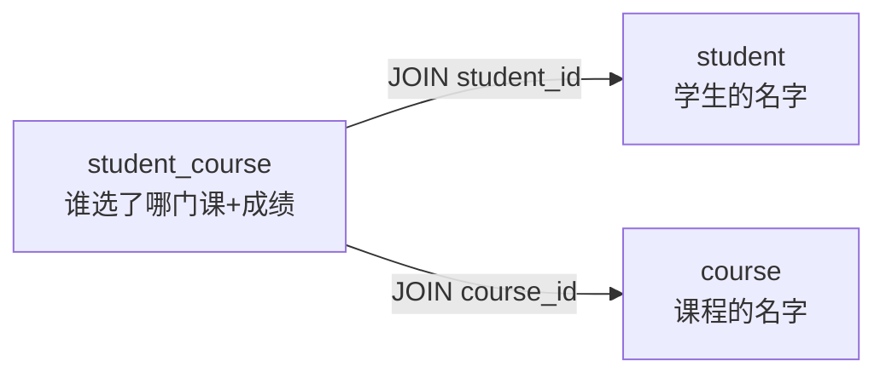

# DQL：查询（SELECT）

> **SELECT 是一次"投屏"**——它把表里的数据原样投到你眼前，**不改变表里任何东西**。所以 DQL 是四类语言里最安全的：写错了最多慢一点，不会删数据。但也正因为"怎么写都对"，**同样的需求，写法好坏可能差出 1000 倍**——本篇的重点，就是判断一条 SELECT 到底走没走索引、值不值这个时间。

## 1. 一眼看懂一句 SELECT

先看一个完整的例子，下面每一节都会拆到它：

```sql
SELECT s.name  AS 学生, COUNT(sc.course_id) AS 选课门数
FROM student s
JOIN student_course sc ON s.student_id = sc.student_id
WHERE s.grade = '高二(3)班'
GROUP BY s.student_id, s.name
HAVING COUNT(sc.course_id) >= 2
ORDER BY 选课门数 DESC
LIMIT 10;
```

逐个片段读（**书写顺序**）：

```text
SELECT  s.name, COUNT(...)       想看到哪些列（还能顺便算：COUNT 计数、AVG 平均分）
  AS 学生 / AS 选课门数           给列起个别名，让结果更好读
FROM   student s                 从哪张表取（s 是表别名，后面省着写）
JOIN   student_course sc ON ...  把另一张表拼进来（等值条件放 ON 里）
WHERE  s.grade = '...'           先过滤：只要高二(3)班的学生
GROUP  BY s.student_id           按学生分组，聚合函数（COUNT/AVG）才能按组算
HAVING COUNT(...) >= 2           对"组"再过滤：只要选课 ≥ 2 门的分组
ORDER  BY 选课门数 DESC          排序：按选课门数从多到少
LIMIT  10                        只取前 10 行
```

> **读懂任何一句 SELECT 的方法：先看 FROM 取了哪张表，再看 SELECT 想拿哪些列；中间的条件、分组、排序，都是往这两个目标中间插的修饰。**

### 1.1 执行顺序：和书写顺序不一样

数据库实际执行时，顺序是反着来的：

```text
书写的顺序：SELECT → FROM → JOIN → WHERE → GROUP BY → HAVING → ORDER BY → LIMIT
实际执行的顺序：FROM + JOIN → WHERE → GROUP BY → HAVING → SELECT → ORDER BY → LIMIT
```

> JOIN 不是独立的一步，它**属于 FROM 阶段**：数据库先把 FROM 的表按 `ON` 条件拼成一张临时结果，后面 WHERE / GROUP BY / HAVING 都在拼好的结果上做。所以 ON 先于 WHERE 执行——这解释了 **ON 和 WHERE 的区别**：ON 是在拼表过程中过滤，WHERE 是拼完后过滤（对外连接结果不同，见 2.2 节）。

> 为什么 HAVING 能用聚合函数、WHERE 不能？因为执行时 **WHERE 先跑（那时还没分组），HAVING 后跑（已经分组了）**。

**这条顺序会带来一个常见的报错**：想在 WHERE 里用别名，比如 `WHERE 选课门数 > 2`——报错。因为 WHERE 执行时 SELECT 还没跑，别名还没出生；要用它，就得放到 HAVING（或再套一层子查询）里。

## 2. 必懂语法：逐段拆解

下面用 `edu_system` 的四张表走查（结构见 [数据库设计](../database-design.md)）：

```text
student( student_id, name, grade )                  -- 学生
teacher( teacher_id, name, phone )                  -- 老师
course( course_id, name, credit, teacher_id )       -- 课程（外键指向老师）
student_course( student_id, course_id, semester, score )  -- 中间表，带成绩/学期
```

每段语法先讲**怎么用**，再看**判断点**。

### 2.1 WHERE：过滤行

把不要的行挡在门外，留下的才进结果。条件由**比较**组合出来：

```sql
SELECT * FROM student_course
WHERE semester = '2026-秋' AND score >= 90;
--               比较 字符串要加引号        数值不用      AND：条件同时满足
```

**WHERE 的语法其实就三样东西：**

```text
① 比较运算符：=  !=  >  <  >=  <=
② 逻辑组合：  AND（且）  OR（或）  NOT（取反）  —— 用括号分组：(A OR B) AND C
③ 专门关键字：IN（在一组值里）  BETWEEN（在区间里）  LIKE（模糊匹配）  IS NULL（是空）
```

几个常用写法的例子：

```sql
-- IN：查指定的一批值
SELECT * FROM student WHERE grade IN ('高二(1)班', '高二(2)班');

-- BETWEEN：查数值区间（含边界）
SELECT * FROM student_course WHERE score BETWEEN 80 AND 90;   -- 等价于 80 <= score AND score <= 90

-- LIKE：模糊匹配，% 表示任意长度的任意字符，_ 表示单个字符
SELECT * FROM student WHERE name LIKE '王%';    -- 姓王的（王开头，后面随便）
SELECT * FROM student WHERE name LIKE '_小%';   -- 第二个字是"小"的

-- 三值逻辑：查"还没分配老师"的课
SELECT * FROM course WHERE teacher_id IS NULL;
```

> **`NULL` 必须用 `IS NULL` / `IS NOT NULL` 判断，不能 `= NULL`。** 因为 `NULL` 表示"不知道"，任何 `= NULL` 比较结果都是 `UNKNOWN`（不成立）——`NULL = NULL` 也查不出来。这是 WHERE 里最容易踩的坑，看到 `= NULL` 八成是写错了。

**判断点 1：WHERE 的作用是"挡行"。** 一行满足条件就留，不满足就走；它只看单行的值，**做不了跨行/跨组的统计**——那是 GROUP BY / HAVING 的事。

### 2.2 JOIN：把多张表拼起来看

数据往往分散在多张表里（学生表存学生，课程表存课程），要一次看全，就得**拼表**。JOIN 的完整语法是：

```text
FROM 表A
JOIN 表B ON 表A.某列 = 表B.某列      -- 把 B 拼到 A 上，按这个等值条件对齐
```

**JOIN 是"按条件把两行合成一行"。** 对 A 的每一行，去 B 里找满足 `ON` 条件的行，找到就拼成一行。`ON` 里写的，就是两张表之间"对齐"的依据——通常是外键（见 [数据库设计](../database-design.md)）。

**JOIN 的三种连法**：

```text
JOIN         内连接：只在两张表都匹配时才出现 —— 不要"没对上"的行
LEFT JOIN    左连接：左表每一行都保留；右表没对上就补 NULL
RIGHT JOIN   右连接：右表每一行都保留；左表没对上就补 NULL
```

```sql
-- 内连接：只显示"有成绩记录"的选课（没人选的课不出现）
SELECT * FROM course JOIN student_course ON course.course_id = student_course.course_id;

-- 左连接：所有课都显示；没被选过的课，成绩那几列是 NULL
SELECT course.name, student_course.score
FROM course
LEFT JOIN student_course ON course.course_id = student_course.course_id;
```

> **心智模型：JOIN 就是"查表的时候顺便去隔壁表取名字"。** `student_course` 只存了 id，想要"名字"这种可读信息，就得 JOIN 过去取。外键指向谁，就 JOIN 谁。

**连多张表：拼完一张，再拿拼好的去拼下一张。** "学生选了哪些课、成绩多少"要跨三张表：

```sql
SELECT s.name AS 学生, c.name AS 课程, sc.score AS 成绩
FROM student_course sc
JOIN student s ON sc.student_id = s.student_id
JOIN course   c ON sc.course_id  = c.course_id;
```



**多张 JOIN 是"逐个拼"，顺序 = 写的顺序，从左往右：**

```text
FROM student_course sc                     ← 起点：一张表
JOIN student s ON sc.student_id = s.student_id   ← 第 1 次拼：用 sc 去 student 找
JOIN course   c ON sc.course_id  = c.course_id   ← 第 2 次拼：拿"拼好的结果"再去 course 找
```

```text
第 1 步：[student_course]                 （一张表，先放着）
第 2 步：[student_course × student]       拼上学生，拿到学生名字
第 3 步：[student_course × student × course]  再拼上课程，拿到课程名字
```

> 关键：**每次 `ON` 用的列，都来自"当前已经拼好的结果"**。第 3 步的 `sc.course_id` 是第 2 步拼出来的表里那一列，不是最原始的 student_course 的"另一个副本"——它们是同一列，一直在结果里带着。

**拼接顺序对结果有没有影响？**
- **内连接（JOIN）**：ON 写对的前提下，先拼谁结果一样——就像乘法结合律，`A×B×C` 怎么乘都是同一个数。
- **左/右连接（LEFT/RIGHT JOIN）**：有影响。**LEFT JOIN 左边那张表的所有行都会保留**（右表没对上补 NULL）。所以"哪张表的所有行都不能丢"，就把它放在 LEFT 那一侧、或写在 JOIN 链的最左边。看下面的例子：

```sql
-- 内连接：只显示有成绩的课，没被选过的课不出现
SELECT c.name, sc.score
FROM course c
JOIN student_course sc ON c.course_id = sc.course_id;

-- 左连接：所有课都显示；没被选过的课，score 是 NULL
SELECT c.name, sc.score
FROM course c
LEFT JOIN student_course sc ON c.course_id = sc.course_id;
```

（三种连法 JOIN / LEFT JOIN / RIGHT JOIN 的例子见本节开头的"三种连法"；"取名字"的心智模型见本节中间的说明。）

**判断点 2：JOIN 写对没写对，看返回行数。** 连接条件写错（比如 `ON sc.course_id = c.teacher_id`）不会报错，但会**多出/变少一堆行**。这是最隐蔽的一类错误——能跑，但结果是错的。

> **ON 和 WHERE 的区别。** ON 是"拼表时过滤"，WHERE 是"拼完后再过滤"。对 INNER JOIN 两者结果一样，但 LEFT / RIGHT JOIN 不同——ON 不满足条件的那行也会保留（补 NULL），而 WHERE 一过滤就把这行删掉了。所以"只要左表的数据"这类需求，条件放 ON 里，别放 WHERE 里。

### 2.3 GROUP BY + HAVING：分组统计

WHERE 只能看单行，要做"每个学生平均分多少"这种**跨行的统计**，就得先**分组**：把 `student_course` 里所有同一 `student_id` 的行归成一组，再对每一组用聚合函数算一个结果。

**GROUP BY 的完整语法：**

```text
SELECT 分组依据的列, 聚合函数(列) [AS 别名] ...
FROM 表
GROUP BY 分组依据的列
[HAVING 对组的过滤条件]
```

**常用聚合函数**（对一组行各算出一个值）：

```text
COUNT(*)   这一组有多少行（计数）
COUNT(列)  这一组里"该列非 NULL"的有几行
SUM(列)    求和
AVG(列)    平均值
MAX / MIN  最大值 / 最小值
```

看个例子，一步步想：

```sql
-- 每个学生选了几门课、平均分多少
SELECT student_id, COUNT(*) AS 门数, AVG(score) AS 平均分
FROM student_course
GROUP BY student_id;
-- 结果：每个 student_id 一行，带着这个学生的选课门数和平均分
```

```text
student_course 表（简化）
  student_id   score
  1            90
  1            80        ── GROUP BY student_id=1 ──▶ 1 | 2 门 | 平均 85
  2            70        ── GROUP BY student_id=2 ──▶ 2 | 1 门 | 平均 70
```

**一个规则要记住**：`SELECT` 里出现的**普通列，必须也在 GROUP BY 里**。因为分组后每组一行，不属于分组依据的列，这组里根本没有唯一值可展示。聚合函数（COUNT 等）不受这个限制——它本来就是"对整组算一个值"。

**HAVING：对分组结果再过滤。** 比如"只要平均分 ≥ 85 的组"：

```sql
SELECT student_id, AVG(score) AS 平均分
FROM student_course
GROUP BY student_id
HAVING AVG(score) >= 85;
```

**判断点 3：WHERE vs HAVING 怎么选。**

| | WHERE | HAVING |
|---|---|---|
| 什么时候执行 | 分组**之前** | 分组**之后** |
| 能不能用聚合函数 | 不能（`AVG(score) >= 85` 报错） | 能 |
| 过滤对象 | 行 | 组 |

> 记法：**"先 WHERE 再 GROUP 再 HAVING"**。想"只看某学期的记录"用 WHERE；想"过滤分组结果"用 HAVING。

### 2.4 子查询：查询套查询

把一条查询的结果（一个值、或一张临时表），当作另一条查询的输入。语法上就是**括号里再写一条 SELECT**，写在三个位置最常用：

```text
WHERE 里的子查询：  WHERE score > (SELECT AVG(score) ...)      -- 子查询返回一个值，跟它比较
FROM 里的子查询：   FROM (SELECT ...) AS 别名                  -- 子查询当作一张临时表用
SELECT 里的子查询： SELECT (SELECT ...) AS 某列                -- 每个结果行都算一次
```

```sql
-- WHERE 里：成绩高于"平均分"的选课记录
-- 先算括号里：SELECT AVG(score) → 一个数；再拿每行 score 跟这个数比
SELECT * FROM student_course
WHERE score > (SELECT AVG(score) FROM student_course);

-- FROM 里：把"每个学生的平均分"当成一张临时表，再查这张表
SELECT * FROM (
    SELECT student_id, AVG(score) AS 平均分
    FROM student_course
    GROUP BY student_id
) AS t
WHERE 平均分 >= 85;
```

> 子查询就是"先算出一个值（或一张表），给外面用"。**能看懂、会写"WHERE 里返回一个值"这种最常见的就够**。嵌套太深反而是坏味道——把简单问题写复杂了，可以考虑拆成两步（比如上面 FROM 里的例子，其实就能用 HAVING 写）。

### 2.5 ORDER BY：排序

默认的顺序没人保证，要按某列排，就得 `ORDER BY`。语法：

```text
ORDER BY 列 [ASC | DESC] [, 列 [ASC | DESC]] ...
       升序(默认) / 降序          多列：先按第一列，相同再按第二列
```

```sql
-- 按成绩从高到低（降序）
SELECT * FROM student_course ORDER BY score DESC;
-- 按成绩降序；成绩相同再按 student_id 升序
SELECT * FROM student_course ORDER BY score DESC, student_id ASC;
-- 对字符串也能排（拼音/字典序）——ORDER BY 中文名 也是可以的
```

> **`ORDER BY` 通常配着 `LIMIT` 用**，比如"成绩最高的前 3 名"：先排好序，再切前 3 条。

### 2.6 LIMIT：只取前几行 / 分页

```sql
-- 成绩最高的前 3 条
SELECT * FROM student_course ORDER BY score DESC LIMIT 3;
-- 分页：跳过前 10 条，取接下来 5 条（第 3 页，每页 5 条 = OFFSET 10）
SELECT * FROM student_course ORDER BY student_id LIMIT 5 OFFSET 10;
-- 等价写法（MySQL/PostgreSQL 都认）：
SELECT * FROM student_course ORDER BY student_id LIMIT 10, 5;   -- LIMIT 偏移量, 数量
```

```text
语法：LIMIT 数量           只取前 N 条
     LIMIT 数量 OFFSET 跳过数  跳过若干条，再取 N 条 —— 这就是分页
```

> **判断点 4（防坑）：没有 LIMIT 的查询可能拖垮数据库。** 写"查前十"的需求，容易忘了 LIMIT，把整张表全捞回来。看查询尾部有没有 `LIMIT`。

## 3. 判断一条 SQL 好不好：索引 + EXPLAIN

语法容易查证；**性能只有自己测了才知道**——本节的每个字都值得记。

### 3.1 数据库怎么找一行：全表扫描 vs 索引

```text
没有索引：从第一行翻到最后一行，找出所有符合的 —— 全表扫描（慢，数据越多越慢）
有索引：  像查字典的拼音索引，直接翻到那一页      —— 索引查找（快，和数据量几乎无关）
```

一本书没有目录，找一句话得从头翻到尾；有目录，翻到页码就能看到。**索引就是表上的"目录"。**

```text
SELECT * FROM student WHERE name = '王小华';
    没有索引：student 表 1 万行，翻 1 万行才找到 → 全表扫描
    有索引：   索引里按名字排好，直接定位         → 秒回
```

### 3.2 EXPLAIN：让数据库告诉你"它打算怎么跑"

`EXPLAIN` 不改数据、不真跑查询，只是让数据库"演示"它会怎么执行——返回的是一张**执行计划表**，一行代表"这个查询的某一步怎么做"。

先看真输出长什么样：

```sql
EXPLAIN SELECT * FROM student WHERE name = '王小华';
```

```text
+----+-----------+-------+------+---------------+----------+---------+-------+------+----------+-------------+
| id | select_ty | table | type | possible_keys | key      | key_len | ref   | rows | filtered | Extra       |
+----+-----------+-------+------+---------------+----------+---------+-------+------+----------+-------------+
|  1 | SIMPLE    | student| ref | idx_name      | idx_name | 202     | const |   2  |  100.00  | Using index |
+----+-----------+-------+------+---------------+----------+---------+-------+------+----------+-------------+
```

这张表怎么看？**横着读，就是一步执行的全部信息**。日常最值得盯的 5 列：

| 列 | 它说什么 | 一眼判断 |
|---|---|---|
| `table` | 这一步在操作哪张表 | 多表 JOIN 会多行，每行一张表 |
| `type` | **怎么找的行** | 🟢 `const`/`eq_ref`/`ref` = 走索引；🔴 `ALL` = 全表扫 |
| `possible_keys` | 可能被用到的索引 | 有 `NULL` 说明这列根本没索引 |
| `key` | 实际用了哪个索引 | 是 `NULL` 就说明没走索引 |
| `rows` | **预估会翻多少行** | 数字越大越慢——这是最直观的"速度计" |

> **判断标准就两条，先用 `type`：`ALL` 就要警惕；再瞄一眼 `rows`：数字很大（接近表大小）也是全表扫的信号。** 只看两列，就够排查绝大多数慢查询。

**`type` 各取值怎么看**（这是"走没走索引"的核心）：

| type 值 | 含义 | 快慢 |
|---|---|---|
| `const` / `eq_ref` | 主键或唯一索引精准定位 | 🟢 最快 |
| `ref` | 普通索引查找 | 🟢 快 |
| `ALL` | **全表扫描** | 🔴 最慢，数据量大就完蛋 |

> 为什么只认 `type`？因为**列名 `key` 可能骗人**——它只显示"用了哪个索引"，但用错索引（比如用了一个区分度很差的索引）照样慢。`type` 描述的是"访问方式"，`ALL` 就是最糟的那种。

**看 EXPLAIN 的最小流程（记两列就够了）：**

```text
① 看 type：是不是 ALL？
   不是 → 走了索引，大概率没问题
   是   → 全表扫描，往下查
② 看 rows：要翻多少行？
   rows 接近整张表行数 → 印证了全表扫，该优化
   rows 很小 → 其实无所谓，不用纠结
③ 看 key：是不是 NULL？
   是 NULL → 这列没索引，该建索引了（见 03-ddl）
```

> 排障习惯：**EXPLAIN 是"先看 type 再瞄 rows"两秒完事**，不用把每列都背下来。看多了自然认得，碰到不认识的就查。

**为什么会 ALL？** 最常见的两种情况：

```text
① WHERE 用的列没建索引
    比如 name 没建索引，WHERE name = '王小华' → ALL
    解决办法：建索引（见 03-ddl），或改用有索引的列（如 student_id）

② 写法导致索引失效（函数包住了索引列）
    WHERE YEAR(create_time) = 2026   -- 把 create_time 包进函数，索引失效 → ALL
    应写成：WHERE create_time >= '2026-01-01' AND create_time < '2027-01-01'
```

### 3.3 慢查询的两步处理：先改写法，再查索引

```text
第一步（改写法）：
  "这条 SQL 用 EXPLAIN 看是 ALL（全表扫描），帮我改成走索引的写法。"

第二步（还是慢，可能是缺索引）：
  "这个查询很慢，帮我看看是不是缺索引，给出 CREATE INDEX 语句。"
```

> 记住：**SQL 是"怎么写都对、但写得好不好差别巨大"的语言。** "能跑"只是及格线，看得出"不够好"、知道往哪个方向改，才是查 SQL 真正的本事。

## 4. 常见误区

| 误区 | 真相 |
|---|---|
| "SELECT 写得能跑就行" | 能跑只是及格。**同一条需求，"走索引"和"全表扫描"可能差 1000 倍** |
| "`= NULL` 能查到空值" | 查不到。**NULL 的比较要用 `IS NULL` / `IS NOT NULL`** |
| "WHERE 能用聚合函数" | 不能。**分组前的过滤用 WHERE，分组后的过滤用 HAVING** |
| "JOIN 能跑就说明对了" | **连接条件写错不报错，但行数会错**。JOIN 完数一下行数对不对 |
| "子查询套得越深越高级" | 嵌套太深是坏味道，**拆成简单两步更好维护** |
| "生成出来的 SQL 就是最优解" | 生成默认给"对"的，**性能要用 EXPLAIN 自己看** |
| "EXPLAIN 那么多列看不懂" | **不用全懂，先看 `type` 是不是 `ALL`，再瞄一眼 `rows`** |

---

**小结**：DQL 不碰数据，最安全，但最练判断——**语法随手可查，性能要用 `EXPLAIN` 自己看**。下一步学最危险的 [02 增删改 DML](./02-dml.md)：那是四类语言里最容易出事的一类。
