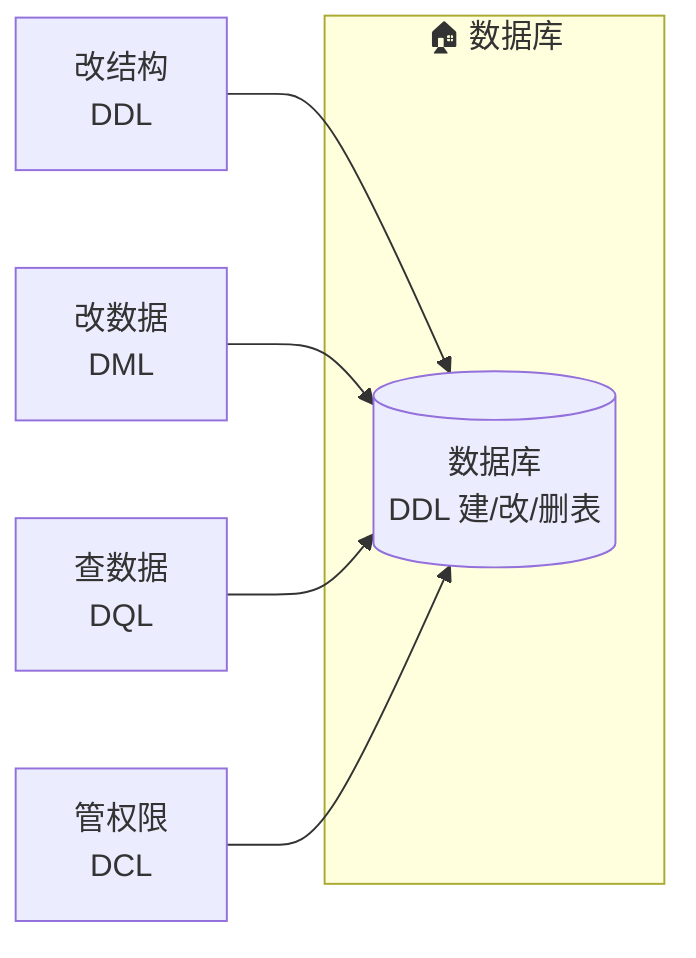

# 数据库操纵语言：DDL / DML / DQL / DCL

> SQL 的写法，随手可查、随处可生成；真正值得花时间的是**判断**——写对了吗、快不快、安不安全。本文定调整个章节：四类语言的语法都过一遍，重点落在"判断对错、判断好坏、守住安全边界"上。四类语言分四篇讲，另附两篇进阶的**视图**和**触发器**：见文末导览。

## 开篇定调：这个章节到底在学什么

教科书会这样教：DDL 定义结构、DML 操纵数据、DQL 查询数据、DCL 控制权限。四个定义不难，但**光背定义不够**——SQL 的写法是工具层面的事，随用随查；真正值得反复练的是**判断力**。

学习的重心，分三层：

| 层 | 内容 | 学习重心 |
|---|---|---|
| 一、具体语法 | `ALTER TABLE ... ADD COLUMN` 怎么写、`GROUP BY` 和 `HAVING` 什么区别 | 语法是工具，认识即可，用时再查 |
| 二、判断对错 | 这条 DDL 会不会破坏已有数据？这条 DELETE 会不会误删？ | **本章重点**——动手前想清楚后果 |
| 三、判断好坏 | 这条 SQL 走不走索引？全表扫还是秒回？权限给多了没有？ | **本章重点**——写得对不等于写得好 |

> 一句话定调：**语法随手可查，判断力才是内功。** 每篇文档都会讲语法，但落点相同——动手前想清楚：**会不会出错、会不会太慢、会不会越权。**

## 一个心智模型：数据库是一栋房子

把四类语言当成四个角色，一次记牢：

```text
DDL  改房子的结构     —— 加一间房、拆一面墙（改表结构）
DML  搬动屋里的家具   —— 往里放东西、拿走东西、换位置（改表数据）
DQL  站门口往里看     —— 只看不碰，不影响屋里任何东西（查询）
DCL  发钥匙收钥匙     —— 谁有这栋房子的钥匙，能开哪几扇门（权限）
```



四类语言按两个维度记住：**它改动谁**（结构 / 数据 / 谁都不动 / 权限），**能不能后悔**（回滚）：

| 语言 | 作用对象 | 一句话 | 能不能后悔 | 风险等级 |
|---|---|---|---|---|
| **DDL** | 表结构 | 改房子结构 | ⚠️ 大多数**不可回滚**（DROP 后就没） | 高 |
| **DML** | 表数据 | 搬家具 | ✅ 包事务可回滚（TRUNCATE 除外） | 中，但最常出事 |
| **DQL** | 无 | 站门口看 | —— 不碰数据，绝对安全 | 低（但最常写） |
| **DCL** | 权限 | 发钥匙 | ✅ 可随时 REVOKE 收回 | 中（安全风险高） |

> 记忆锚点：**改结构的代价最大（不可回滚），改数据的频率最高（最常出事），查询最安全也最需要"判断好坏"，权限最容易被忽略。**

## 四类操作，各自容易错在哪

| 语言 | 最常踩的坑 | 动手前要判断什么 |
|---|---|---|
| DDL | 建表时"每个字段都加索引"；给有数据的表加 NOT NULL | 会不会破坏已有数据？索引是不是乱建？DROP 前想清楚 |
| DML | DELETE / UPDATE **漏了 WHERE**，一执行全表遭殃 | WHERE 带没带？包不包事务？删空表用 TRUNCATE 还是 DELETE？ |
| DQL | SQL "能跑但慢"——没走索引、没加 LIMIT | 走索引吗？EXPLAIN 的 type 是什么？分页了吗？ |
| DCL | 一键开 root / 权限给得又大又散 | 最小权限：只给够用的，别给最高级 |

四篇文档对应这四行，各讲各的深。

## 文档导览

| 文档 | 讲什么 | 重点 |
|---|---|---|
| [01 查询 DQL](./01-dql.md) | 一眼读懂 SELECT / WHERE / JOIN / GROUP BY / 子查询 / ORDER BY / LIMIT | **判断 SQL 好坏**：索引、EXPLAIN、慢查询两步处理 |
| [02 增删改 DML](./02-dml.md) | INSERT（多行/搬数据）/ UPDATE / DELETE / 事务 / 回滚与备份 | **护命三件事**：先查后改、包事务、删空表能不能回滚 |
| [03 改结构 DDL](./03-ddl.md) | 建库（CREATE DATABASE）/ 建表 / ALTER / DROP / CREATE INDEX（索引增删） | **动手前想清楚三件事**：破坏数据、乱建索引、DROP 三思 |
| [04 权限 DCL](./04-dcl.md) | 用户从哪来（CREATE USER）/ GRANT / REVOKE / 最小权限 | **最小权限**：一个账号一份权限 |
| [05 视图 VIEW](./05-view.md) | 视图是什么 / CREATE VIEW / 当表用 / 权限挡板 | **进阶**：把常用的复杂查询存起来当表用（DQL 的延伸） |
| [06 触发器 TRIGGER](./06-trigger.md) | 三要素 / CREATE TRIGGER / 该用 vs 别用 / 与事务的关系 | **进阶**：操作发生时自动执行的 SQL（DML 的延伸） |

> 学习顺序建议：**01 → 02 → 03 → 04**。DQL 最常写、最能练"判断好坏"，先啃它；DML 最危险，紧接着学；DDL 相对独立，最后扫；**DCL 日常接触少，认识即可，不用深究**。想先保命，可以先跳 02。**视图 05 是 01 的进阶延伸，触发器 06 是 02 的进阶延伸**，分别读完 01 / 02 再看最顺。

## 动手之前：一份四类语言自查清单

四篇读完后，把四类语言串成一条流程，写任何一句 SQL 前都按这套走：

```text
描述清楚要什么
   ↓
落成 SQL
   ↓
动手前自查：
  ① 查：EXPLAIN 看走不走索引（见 01-dql）
  ② 改：先 SELECT 再看 DELETE/UPDATE，确认 WHERE 精确（见 02-dml）
  ③ 建：新表核对结构，索引只给常查的列（见 03-ddl）
  ④ 权：权限是"够用最小"，不是 root（见 04-dcl）
   ↓
改数据一律进事务（见 02-dml）
```

一条自查清单，四类语言各占一行，改哪类就查哪行：

```text
□ DQL：EXPLAIN 过了吗？type 不是 ALL（全表扫描）吧？
□ DML：WHERE 带了吗？事务包了吗？删空表知道 TRUNCATE 不可回滚吗？
□ DDL：这步会不会破坏已有数据？索引建对了吗？DROP 之前真确定吗？
□ DCL：这个账号只拿到够用的权限吗？能 REVOKE 吗？（日常接触少，认识即可）
```

---

**下一步**：从最常写、最练判断力的 [01 查询 DQL](./01-dql.md) 开始。
